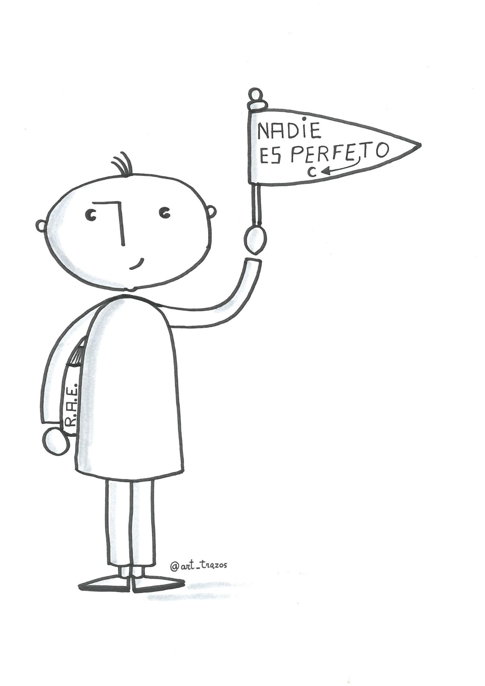

# 1 INTRODUCCIÓN {#1-introducci-n}

¿Empiezo el discurso con una pregunta? ¿Con una anécdota personal? ¿Debo evitar dar la espalda al público? ¿Puedo llevar unas notas por si me quedo en blanco? ¿En folio o en tarjeta? ¿Es imprescindible sonreir? ¿Y mostrar las palmas de las manos para generar confianza? ...

Las respuestas a estas preguntas  no la vas a encontrar en este módulo. Tampoco las vas a encontrar en ningún manual de oratoria.

La [oratoria es definida por la RAE](https://www.google.com/url?q=http://dle.rae.es/?id%3DR8qgr7H&sa=D&ust=1516789737965000&usg=AFQjCNHmhnubL_sPro3UZtZhNfoGsLjaVA) como el “arte de hablar con elocuencia”.  Se trata de una destreza cultural que podemos perfeccionar. Michel Suñer (2008) en su libro Cómo enamorar hablando en público cita algunos aspectos que nos ayudarán a transformar las aptitudes (poder potencial) en capacidades para la oratoria. Destacamos aquí: entusiasmo, confianza (aún sin sentirla), naturalidad, afán de superación, ejercitación y  aprendizaje de técnicas.

Como todo arte, el éxito no depende de una aplicación estricta del conocimiento teórico. Guillermo Ballenato Prieto (2006) dice “seremos mejor comunicadores en tanto seamos capaces de movernos con flexibilidad en los diferentes intercambios comunicacionales y sepamos conjugar la aplicación de las estrategias y el cumplimiento de determinados aspectos formales con la autenticidad, la naturalidad y el propio estilo personal”. En la comunicación humana no hay normas ni estrategias rigurosas que aseguren la eficacia y el éxito, solo consejos y un plan para mejorar a través de la práctica.

Está claro que a comunicarnos eficazmente no aprenderemos leyendo los contenidos de este curso (al igual que a nadar no se aprende leyendo un manual). Tampoco aprenderemos practicando sin más: imagina que tu charla no ha conseguido el efecto que tenías previsto. Puedes pensar que a la siguiente saldrá mejor, pero eso sería dejarlo al azar. Para que a la próxima salga mejor necesitas: criterios, referentes, datos para la reflexión, sentido crítico y, muy importante, feedback sincero.

El objetivo principal del tiempo que vas a dedicar a este módulo es obtener claves para la reflexión y el autoconocimiento que guiará, si eres una persona dispuesta, tu mejora en el arte de la oratoria y la comunicación eficaz.

Acompañaremos los contenidos con charlas disponibles en la red que te servirán para que vayas configurando una idea de cómo sería el “comunicador perfecto”... ese que ya te adelantamos, no existe. Nadie es perfecto.

Empezamos con Fidel Delgado. En su conferencia “Cómo instalarse la app del humor” (del minuto 11 al minuto 13) desarrolla su idea de “buffet libre de aprendizaje”  que se asemeja bastante a nuestra propuesta: sírvete lo que creas que te viene bien y ejercítalo. ¡Buen provecho!

[https://vimeo.com/208641993](https://www.google.com/url?q=https://vimeo.com/208641993&sa=D&ust=1516789737967000&usg=AFQjCNGWY98RpHZ_HGMRJSeXTavcvCIhMQ) 

Nadies es perfecto. @art_trazos